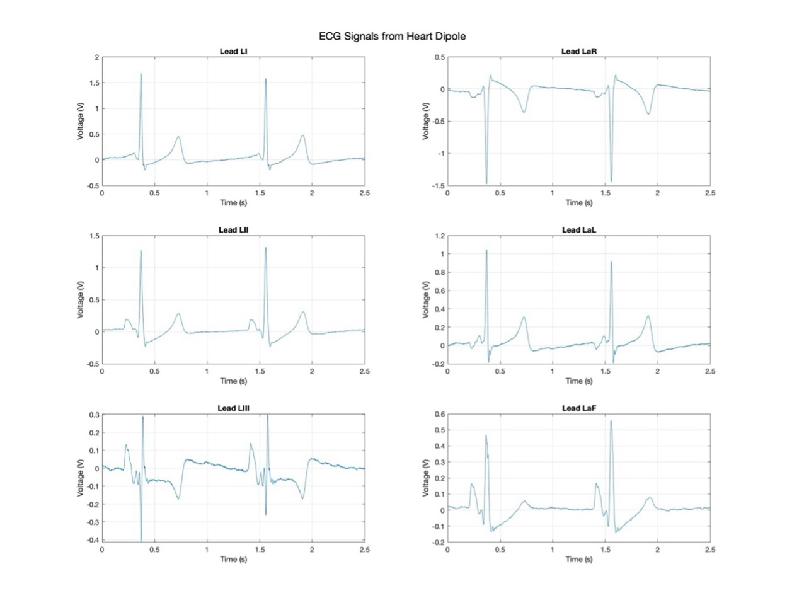
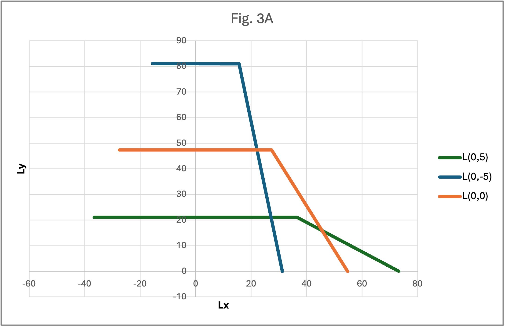
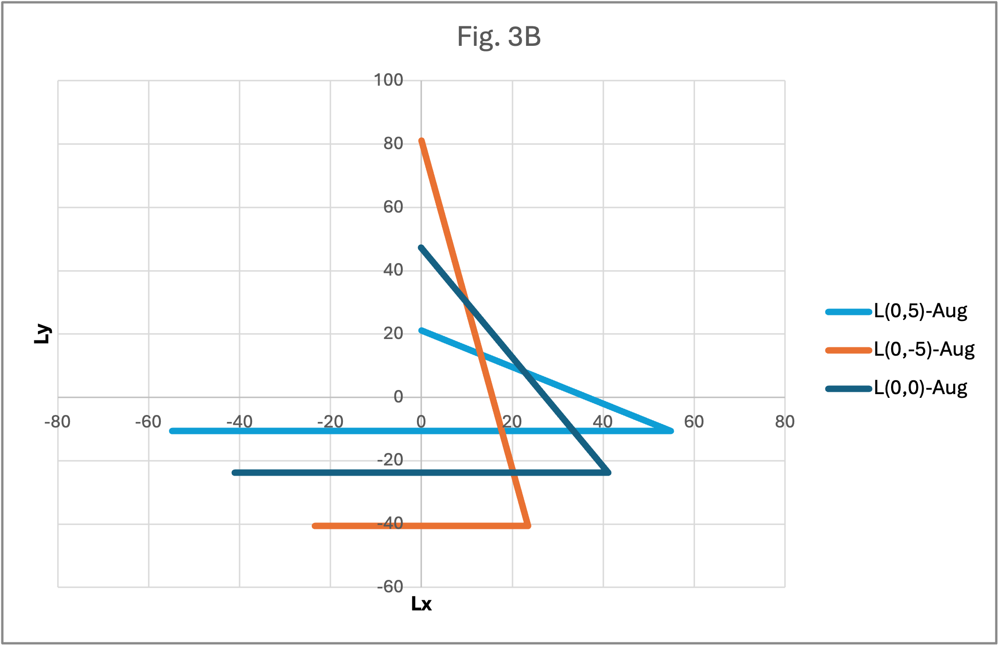
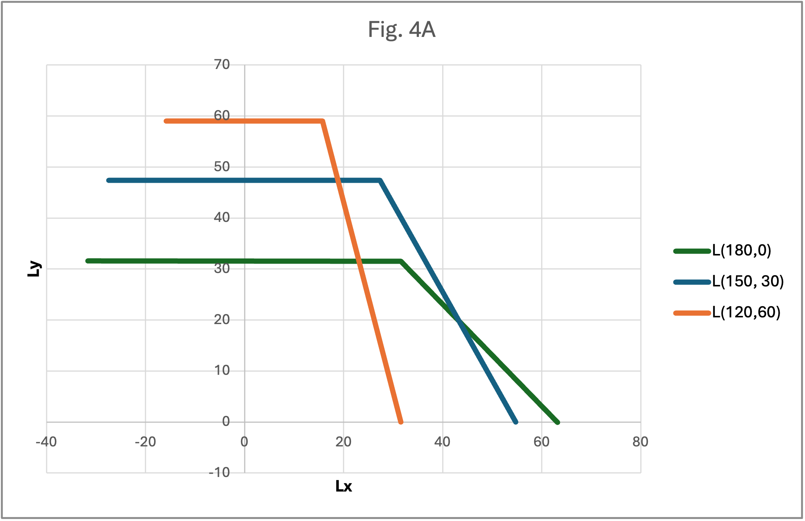
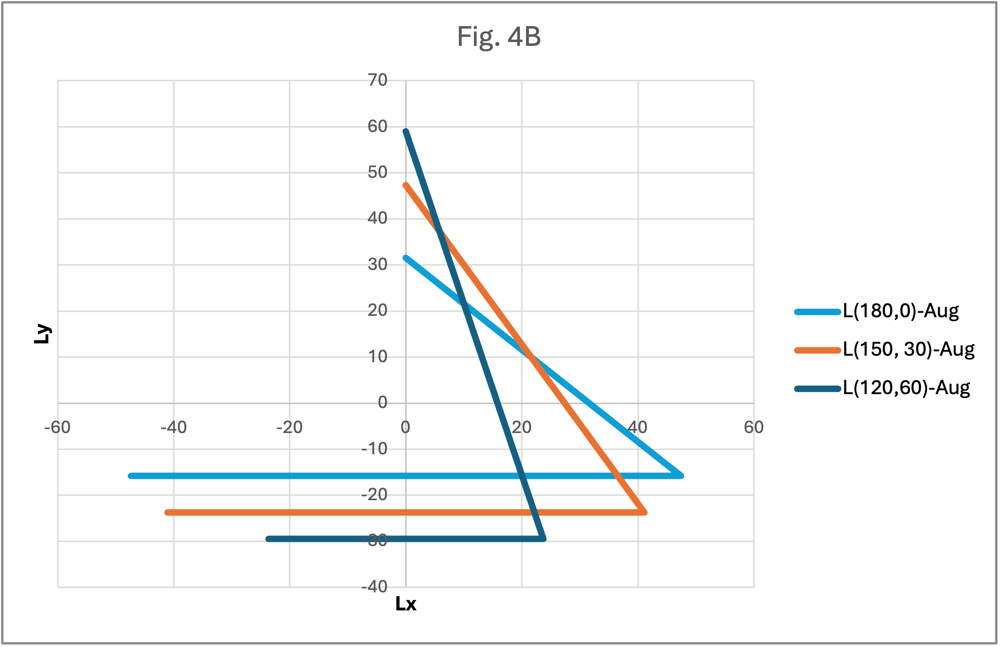
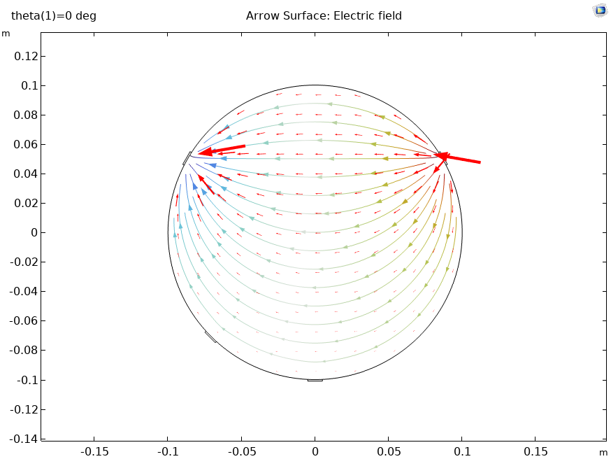
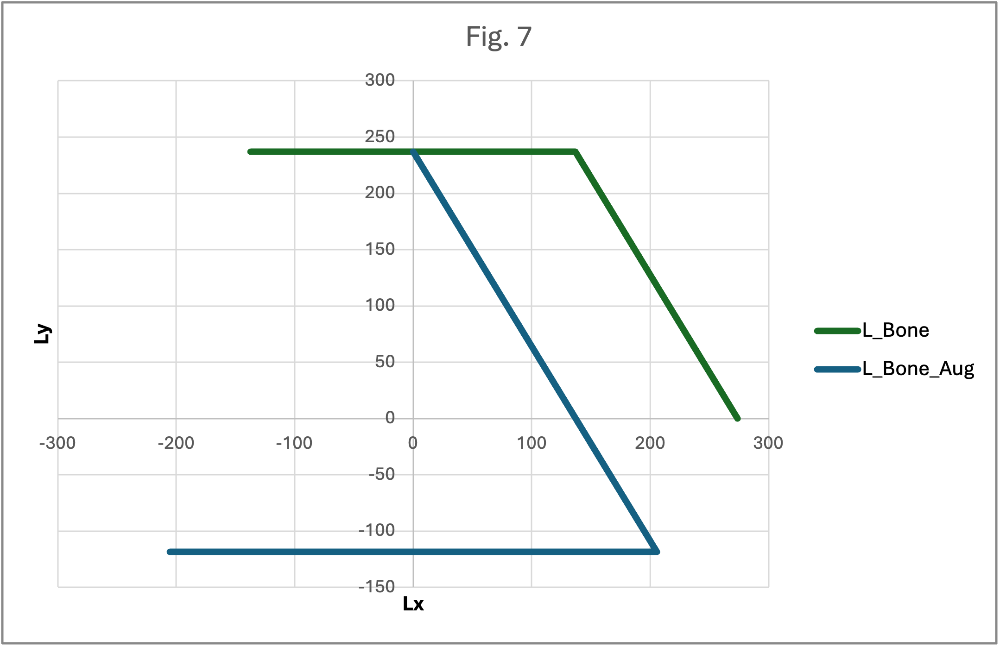

# 🫀 COMSOL Simulation: ECG Lead Fields and Vector Mapping (HW #5)

This project models the electrocardiographic lead field theory using COMSOL. It computes lead vectors, evaluates the reciprocity theorem, explores displacement and orientation effects on a simulated dipole, and calculates real ECG lead signals using matrix multiplication of heart dipole data.

---

## 📘 Overview

Using COMSOL Multiphysics, this simulation:
- Constructs limb leads (RA, LA, LL) as surface electrodes
- Models a dipole at various positions inside a circular torso
- Computes lead voltages and vectors for:
  - Leads I, II, III
  - Augmented leads: aVR, aVL, aVF
- Verifies the **reciprocity theorem** via reciprocal energization
- Analyzes how **inhomogeneous tissues (e.g., bone)** affect field shape

---

## 🔧 COMSOL Setup

- Circular torso (radius = 10 cm)
- Dipole separation = 4 mm
- Dipole moment = 0.03 mA
- Electrode dimensions = 1 cm × 2 mm
- Reference electrode at 225°
- Materials: muscle (torso), stainless steel (electrodes), optional bone

---

## 🧪 Results by Section

### 1️⃣ Lead Vectors from Direct Dipole at Center

Computed for angle `a = 0°` and `–90°`:

| Lead | Lx (Ω) | Ly (Ω) | Magnitude (Ω) |
|------|--------|--------|----------------|
| LI   | 54.76  | 0.02   | 54.76          |
| LII  | 27.34  | -47.39 | 54.71          |
| LIII | -27.43 | -47.41 | 54.77          |
| aVR  | -41.05 | 23.69  | 47.39          |
| aVL  | 41.09  | 23.72  | 47.45          |
| aVF  | -0.05  | -47.40 | 47.40          |

📐 **Ratio of triangle magnitudes (bipolar vs augmented):**  
📊 **Answer:** `1.15` (matches theoretical prediction)

---

### 2️⃣ Real-Time ECG Signal Reconstruction

- Imported heart dipole vector `H(t)` (2500 samples)
- Performed matrix multiplication with 6 lead vectors
- Plotted waveforms: `VI`, `VII`, `VIII`, `aVR`, `aVL`, `aVF`
- Refer [Part_2.m] 

🧠 **Conclusion**: Vector projection yields realistic frontal ECG traces with efficient computation.

---

### 3️⃣ Dipole Displacement

Dipole moved to `(0, 5)` and `(0, –5)`:

- Lead vectors were recalculated and plotted
- All sets still formed **triangles** (not equilateral)
- Triangles visually shifted but retained shape integrity

✅ Answer: They still form valid triangles within numerical error.

📊 See: `Fig 3A` and `Fig 3B`

---

### 4️⃣ Asymmetric Electrode Angles

Simulated 3 lead configurations:
- `(180°, 0°)`, `(150°, 30°)`, `(120°, 60°)`

Lead vector triangles were skewed as expected.

✅ Answer: Still form triangles, but not equilateral. They mirror electrode geometry.

📐 See: `Fig 4A`, `Fig 4B`

---

### 5️⃣ Reciprocal Energization

- Applied normal current to LA and RA electrodes (lead I)
- Measured resulting potential at dipole location

🧪 Result:
- `V1 = 1.643 mV` ≈ `VI from original dipole` ✅  
- Verified reciprocity theorem

📊 Also repeated for Lead II (`V2 = 0.820 mV`) — matched expected result.

---

### 6️⃣ Lead Field Visualization

Used reciprocal setup to:
- Plot electric field `E` across torso
- Sample field at `(0, –5)`, `(0, 0)`, `(0, 5)`

| Position | L1x (Ω) | L1y (Ω) | Magnitude (Ω) |
|----------|--------|--------|----------------|
| (0, –5)  | –31.41 | –0.05  | 31.41          |
| (0, 0)   | –55.00 | –0.02  | 55.04          |
| (0, 5)   | –73.48 | –0.001 | 73.48          |

🧠 Matches previous results via direct method.

📍 See: `Fig 5` for quiver plot

---

### 7️⃣ Non-Uniform Torso: Bone Tissue

- Added low-conductivity region (σ ≈ 0.02 S/m, ε_r ≈ 250)
- Recomputed lead vectors for center dipole

| Lead | Lx (Ω) | Ly (Ω) | Magnitude (Ω) |
|------|--------|--------|----------------|
| LI   | 273.84 | –0.11  | 273.84         |
| LII  | 136.69 | 236.98 | 273.58         |
| LIII | –137.15| 237.08 | 273.90         |

🧠 Most leads still form an **equilateral triangle**, except LI.  
📊 See: `Fig 7`

---

## 📂 Files Included

| File | Description |
|------|-------------|
| `COMSOL-1.mph` | Main simulation model (Parts 1–6) |
| `COMSOL-2.mph` | Model with inhomogeneous medium (Part 7) |
| `Supplement-Doc.docx` | Final results, tables, and figures |
| `Hvector2D.mat` | Dipole vector input for ECG synthesis |

---

## 👨‍🔬 Author

Manan Bhatt  
Johns Hopkins University — Applied Bioelectrical Engineering  
COMSOL HW #5 — Spring 2025
